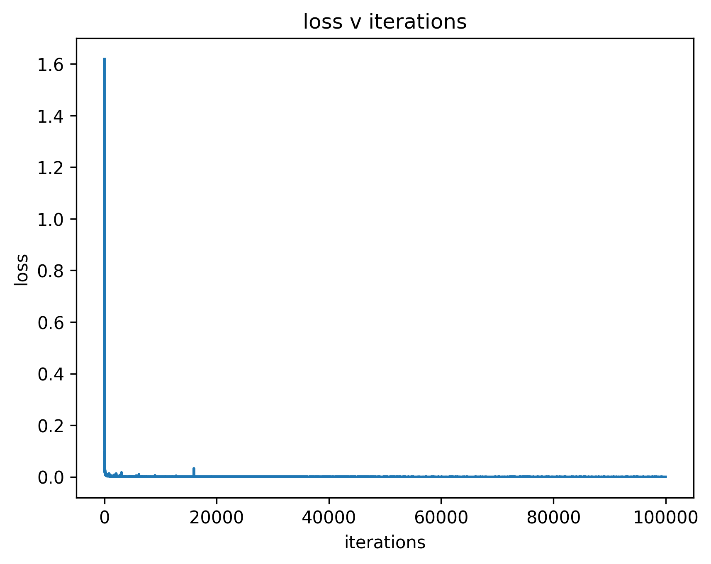

# Pricing Options using Deep Operator Learing

A demonstration for pricing call options using neural networks.

## The Black Scholes Merton Equation:

Consider an security valued at $S$. For a call option superjacent to this security with strike price $K$ and maturation time $T$, the apporpriate price for the call option $C(t, S)$, $\forall t < T$, and, $S \in [0,\infty)$ is given by the Black Scholes Merton equation:

$$
\dfrac{\partial C}{\partial t} + \dfrac{1}{2}\sigma^2 S^2 \dfrac{\partial^2 C}{\partial S^2} + rS\dfrac{\partial C}{\partial S} -rC = 0
$$
Where $\sigma$ is the volatility of the security and $r$ is the riskfree interest rate, say, the treasury bond interest rate. Also based on the nature of the call option contract, we can write the boundary conditions and final value condition at $T$ as:
$$
\begin{align*}
   &C(t, 0) = 0 &&\text{for all $t \geq 0$}\\
   &C(t, S) \to S - K &&\text{for all $t \geq 0$ as $S \to \infty$}\\
   &C(T, S) = \max\{S - K, 0\}
\end{align*}
$$

**Intuition:** If one chooses the perfectly conservative move; making a position on a security (long or short), while hedging the position against risk with the appropriately balancing option (put or call), then one's expected profit rate should be the same as the risk-free interest rate in the market. This push and pull between the option price and stock price is illustrated by the above differential equation.

**Note:** This formulation makes a bunch of assumptions:
1. Security price is a GRF, with constant volatility. The security trading is pure, it does not pay dividends - its price is set purely by demand-supply.
2. The riskfree rate remains constant as well.
3. The option is only sold at maturity (European, not American options).

## Why (and why not) use neural networks?
The above equation is a partial differential equation (PDE). We can solve this PDE, using neural networks (PINNs), but ultimately PINNs do not offer any advantage over numerical methods for this case. They are relatively inaccurate, take a long time to train, and are riddled with boundary pathologies.

But if we consider the parametric problem statement, i.e. the parameters $\sigma$ and $r$ are independent random variables (not random fields, yet) themselves, then the problem becomes much more tedious and scales poorly with numerical methods. But even this formulation can be solved easily with PINNs with a somewhat ad-hoc formulation, but there is a more appropriate way to do this

There are different ways to view this problem - 

1. Since the parameters of the PDE are random variables, it is a case of simply a parametric stochastic differential equation, with a stochastic process as solution. We can approximate using PINNs and use MCMC-type methods to characterize the posterior.
2. More appropriately and simply, the PDE can be viewed as an operator over the field function, of the form $\mathcal{K} : \mathcal{\Psi}(\sigma, r) \rightarrow C_{\delta, r}$, mapping the parameters to a functions in the $\mathcal{L}^2$ space.

## What is an Operator, and how do we learn it using Deep Operator Networks (DeepOnets)?

An operator, simply put, maps a function to a function, for example $\frac{d(\cdot)}{dx}$. We can say, $G: V \rightarrow C$ such that $f(x) := G(u)(x)\;$ for $f\in C$ and $u \in V$. As it turns out, neural networks are [universal approximators of nonlinear operators](https://ieeexplore.ieee.org/document/392253) just like they are universal approximators of functions. But how can we input functions into a neural networks? This is unintuitive at first, and once we write it down, it might even seem a bit ad-hoc. But fundamentally, there is no difference between operator learning and function learning from the point of view of a neural network. We essentially just pose operator learning as a function learning problem. We follow the formulation and conventions of [Lu et al.](https://arxiv.org/abs/1910.03193) with minor deviances to match our requirements. We can use the problem at hand to formulate the operator learning problem as follows:

$$
C_{(\sigma, r)}(t, S) =  \;\sum_{i=1}^n \Psi^{(w_{\psi})}_i(t, S)B^{(w_b)}_i(\sigma, r)
$$

Where, 
$\rightarrow C_{(\sigma, r)}(t, S)$ is the option price at time $t$, security price $S$ with volatility $\sigma$ in a market with risk-free interest rate $r$. 
$\rightarrow n$ is a latent dimension size (will be clarified further). 
$\rightarrow B^{(w_b)}_i$ is the $i^{th}$ of $n$ scalar valued neural networks or the $i^{th}$ output of a stacked neural network of the form  $B: \mathbb{R}^2 \rightarrow \mathbb{R}^n$ with weights $w_b$, also known as the branch network.

$\rightarrow \Psi^{(w_b)}_i$ is the $i^{th}$ of $n$ scalar valued neural networks or the $i^{th}$ output of a stacked neural network of the form  $\Psi: \mathbb{R}^2 \rightarrow \mathbb{R}^n$ with weights $w_{\psi}$, also  known as the trunk network.

## How do we train such a network?

The universal approximation theorems are only one side of the coin. The other side is the universal approximation for an algorithm that can actually find such neural networks (by finding the appropriate weights). This is the[ stochastic approximation method](https://projecteuclid.org/journals/annals-of-mathematical-statistics/volume-22/issue-3/A-Stochastic-Approximation-Method/10.1214/aoms/1177729586.full), where Robbins and Monroe posit that the minimum of a loss function $L$ is coincides with minima of the expectation of the form $\mathbb{E}_{X}[f(L)]$, where $X$ is the 'data'.

For our case we can spell out our loss function as,

$$
\mathcal{L}(w) = \int_0^{r_{max}} \int_0^{\sigma_{max}}  \int_0^T \int_0^{S_{max}} R(w)dt dS d\sigma dr
$$

Where,

$$
R(w) = \left|\lbrace\left(\dfrac{\partial}{\partial t} + \dfrac{1}{2}\sigma^2 S^2 \dfrac{\partial^2}{\partial S^2} + rS\dfrac{\partial}{\partial S} -r \cdot() \right)\left[\;\sum_{i=1}^n \Psi^{(w_{\psi})}_i(t, S)B^{(w_b)}_i(\sigma, r)\right]\rbrace\right|^2
$$
1. We can easily convert the integrals into expectations by making a few assumtions, $r \sim \mathcal{U}(0, r_{max})$, $\sigma \sim \mathcal{U}(0, \sigma_{max})$ and so on. 
2. And then we approximate the expectation using sampling averages.
3. Robbins Monroe guarantees this converges to the required minimum as long as the learning rate satisfies the convex conditions.

## Discussion:

The model we have used here is a simple MLP, and training is rather fast and quick:

We can now easily sample each of $r, \sigma, S, t$ and plot our cost curves and evaluate required analytics:

This allows vast sampling, enabling MCMC type of analysis.
